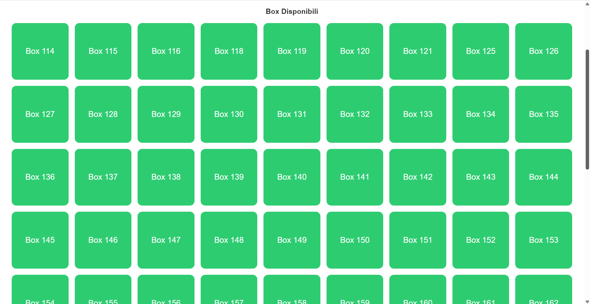

# Locker Social Club

Locker Social Club è un sistema di gestione locker situato all’interno di uno spazio di lavoro condiviso (coworking), dove più aziende affittano uffici e gli ospiti possono usufruire di servizi comuni come bar, cucina, zona relax e locker condivisi.

Il sistema consente di depositare e ritirare oggetti in modo sicuro tramite PIN, senza transazioni economiche, poiché il servizio è incluso nell’ambiente.

---

## Funzionalità principali

### Utente

- Selezione di un box disponibile
- Inserimento e generazione di un PIN
- Apertura del box per il deposito
- Ritiro del materiale inserendo il PIN precedentemente generato

### Admin

- Accesso tramite login
- Accesso protetto tramite autenticazione
- Visualizzazione dello stato di tutti i locker
- Gestione dei box in caso di guasti o problemi
- Intervento forzato per sbloccare situazioni critiche
- Storico delle operazioni effettuate sul sistema

---

## Tecnologie utilizzate

### Back-end
- Java
- Spring Boot
- MySQL
- IntelliJ IDEA

### Front-end
- JavaScript
- React (JSX)
- HTML
- CSS
- VS Code

---

### Home page – deposito e ritiro

### Selezione box disponibili

### Inserimento PIN

### Conferma deposito

### Pannello admin

---

## Avvio del progetto

### Back-end

1. Clonare il repository: git clone https://github.com/Davide91-code/LockerSocialClub.git
2. Configurare il database MySQL
3. Creare il file `application.properties` usando come riferimento `application.properties.example`
4. Avviare il progetto con: `mvn spring-boot:run`

### Front-end

1. Entrare nella cartella frontend

2. Installare le dipendenze: `npm install`

3. Avviare il progetto: `npm start`

4. Accedere al portale tramite browser